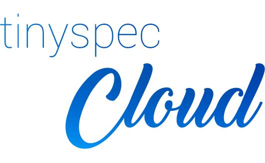

# Tinyspec Cloud CLI


[](https://npmjs.com/package/tinyspec-cloud)

This CLI allows you to deploy your OpenAPI specification to [**Tinyspec Cloud**](https://tinyspec.cloud) and then
access its auto-generated versions in different formats (HTML, PDF, YAML, JSON).

#### Usage:

```bash
npm i tinyspec-cloud

tinyspec-cloud --name my-project
```

#### Result example:
> 🎉 Congratulations!
>
> Your project **my-project** is created in **Tinyspec Cloud**.
>
> In a couple of minutes it will be published to these URLs:
>
>     https://my-project.tinyspec.cloud
>     https://my-project.tinyspec.cloud/index.pdf
>     https://my-project.tinyspec.cloud/openapi.yaml
>     https://my-project.tinyspec.cloud/openapi.json
>     https://my-project.tinyspec.cloud/build.log
>
> Please store your access key: `XkRTlERUICxnaATXBAH4E9oTwlvD`.
>
> If you lose your key, you won't be able to publish updates to your project.

#### More info:
https://tinyspec.cloud
